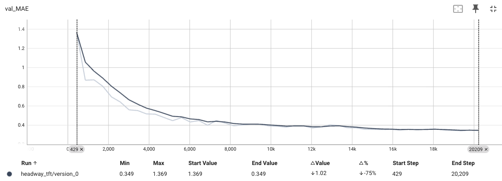
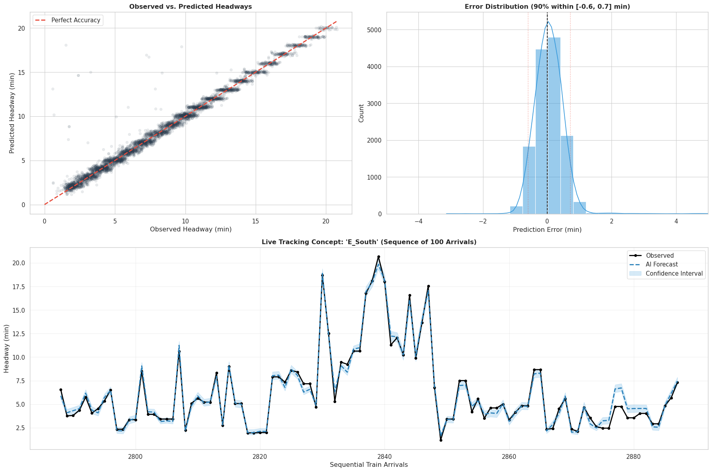

# NYC Subway Headway Prediction

Real-time headway prediction for A, C, E subway lines at West 4th Street-Washington Square station.

---
This repo is under construction.

I'm very happy to report, we've reached state of the art performance, training a Temporal Fusion Transformer Model. 
 
### Global Test Metrics
|Metric | Value|
|:---|:---|
|Quantile Loss | 0.2370 |
MAE (P50)      | 0.3549 minutes |
sMAPE (P50)    | 0.0596 |
P10 Coverage   | 0.183 (Target 0.10) |
P90 Coverage   | 0.882 (Target 0.90) |

### Metrics by Group ID

| Group Name | MAE | Samples |
|:---|:---|:---|
| OTHER_South | 1.274283 | 20 |
| A_South | 0.366566 | 5082 |
| C_South | 0.365025 | 3135 |
| E_South | 0.335689 | 5677 |

  
    

  
    

Over the next few weeks, I will create a production ML infrastructure to train the model and deploy a real time inference endpoint, to make predictions.  I will also create a real time data ingestion pipeline to process an event stream and call on the prediciton endpoint to make real time headway predictions and store them in a nosql database.  The final layer will be a mobile application that will serve the predictions from the nosql database to passengers, helping them manage uncertainty with their commute.

I expect the total effort to be complete towards the end of February 2026.
