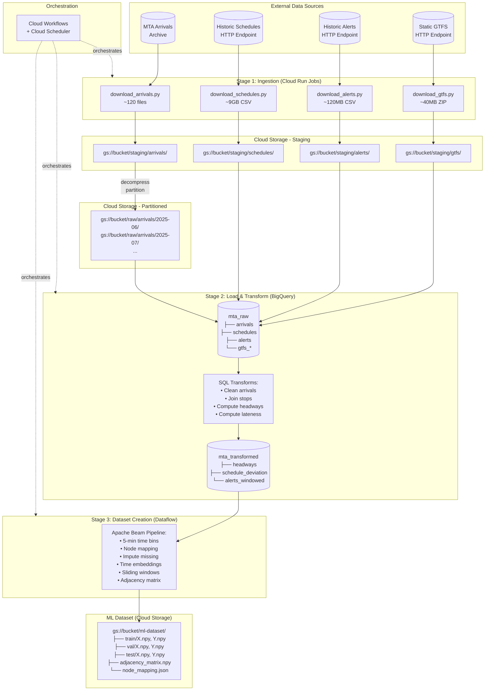
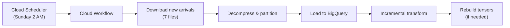

# Data Pipeline Architecture for ML Dataset Creation

## Overview

This document describes the 3-stage batch data pipeline for creating a Graph WaveNet training dataset from MTA transit data on Google Cloud Platform.

---

## Data Sources

| Source | Size | Files | Update Frequency | Ingestion Method |
|--------|------|-------|------------------|------------------|
| **Historic Arrivals** | ~10MB/day | ~120 files (4 months) | Daily/Weekly | Python → decompress → partition → BigQuery |
| **Historic Schedules** | ~9GB | 1 CSV | One-time | Python + requests → Cloud Storage |
| **Historic Alerts** | ~120MB | 1 CSV | Archive for training | Python + requests → Cloud Storage |
| **Static GTFS** | ~40MB | 6 .txt files | Rarely | Python + requests → unzip → Cloud Storage |

---

## Architecture Diagram

---

## Infrastructure Components

| Component | GCP Service | Purpose |
|-----------|-------------|---------|
| Ingestion scripts | **Cloud Run Jobs** | Containerized Python, pay-per-use |
| File storage | **Cloud Storage** | Staging, raw, and final datasets |
| Data warehouse | **BigQuery** | SQL transforms, joins, aggregations |
| Tensor creation | **Cloud Dataflow** | Apache Beam for complex processing |
| Orchestration | **Cloud Workflows** | Chain pipeline stages |
| Scheduling | **Cloud Scheduler** | Trigger weekly ingestion |

---

## Pipeline Stages

### Stage 1: Ingestion

**Goal:** Download all source data to Cloud Storage

| Job | Input | Output | Frequency |
|-----|-------|--------|-----------|
| `download_arrivals` | MTA archive API | `gs://bucket/raw/arrivals/{yyyy-mm}/` | Weekly (Sunday) |
| `download_schedules` | HTTP endpoint | `gs://bucket/staging/schedules/` | One-time |
| `download_alerts` | HTTP endpoint | `gs://bucket/staging/alerts/` | One-time (archive) |
| `download_gtfs` | HTTP endpoint | `gs://bucket/staging/gtfs/` | One-time |

### Stage 2: Load & Transform

**Goal:** Clean data, compute derived features in BigQuery

| Transform | Input Tables | Output Table | Logic |
|-----------|--------------|--------------|-------|
| Clean arrivals | `arrivals` | `arrivals_cleaned` | Filter route_id ∈ {A, C, E}, parse timestamps |
| Join stops | `arrivals_cleaned` + `gtfs_stops` | `arrivals_with_stops` | Add stop_name for interpretability |
| Compute headways | `arrivals_with_stops` | `headways` | `arrival_time - LAG(arrival_time)` per node |
| Compute lateness | `arrivals_with_stops` + `schedules` | `schedule_deviation` | `actual - scheduled` per trip/stop |
| Window alerts | `alerts` | `alerts_windowed` | Aggregate to 5-min bins per route |

### Stage 3: Dataset Creation

**Goal:** Build tensors for Graph WaveNet training

| Step | Description |
|------|-------------|
| Time binning | Aggregate to 5-minute intervals |
| Node mapping | Create (station, line, direction) → node_id |
| Imputation | Forward-fill missing headways |
| Time features | sin/cos encoding of time-of-day, day-of-week |
| Sliding windows | Create (X, Y) pairs: 12 steps in → 12 steps out |
| Adjacency matrix | Build graph from route topology |
| Train/Val/Test split | Temporal split (no shuffle) |

---

## Cost Optimization

| Decision | Rationale |
|----------|-----------|
| Cloud Run Jobs (not VMs) | Pay only during execution |
| BigQuery on-demand | Pay per TB scanned; small dataset = low cost |
| Dataflow FlexRS | 40% cheaper for batch jobs |
| Weekly batch (not daily) | Fewer job runs |
| Bash setup (not Terraform) | Simpler for small infra footprint |

---

## Weekly Operations

---

## File Locations

| Type | Path |
|------|------|
| **Staging** | `gs://{project}-data/staging/{source}/` |
| **Raw partitioned** | `gs://{project}-data/raw/arrivals/{yyyy-mm}/` |
| **ML dataset** | `gs://{project}-data/ml-dataset/{version}/` |

---

## Next Steps

1. ✅ Create project scaffolding
2. ⏳ Run `setup_gcp.sh` to create GCP resources
3. ⏳ Add existing download scripts
4. ⏳ Write SQL transforms
5. ⏳ Build Dataflow pipeline
6. ⏳ Configure Cloud Workflows
7. ⏳ Test end-to-end
