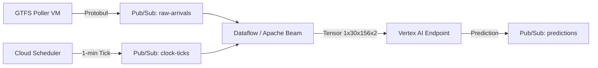

# Real-Time Preprocessing Pipeline Plan (Apache Beam)

## 1. Objective
To implement a production-grade streaming pipeline that transforms raw GTFS-Realtime feeds into the exact spatiotemporal tensors required by the ST-ConvNet model, ensuring **Training-Serving Symmetry**.

## 2. Architecture Overview



## 3. Core Challenges & Solutions

### Challenge A: Training-Serving Symmetry
**Problem:** Logic defined in Pandas (`resample().ffill()`) is batch-oriented. Beam is stream-oriented.
**Solution:** Create a shared Python package (`headway_lib`) containing the core constants and transformation logic.
*   **Training:** `headway_lib` is imported by the Trainer to process `.npy` files.
*   **Serving:** `headway_lib` is installed on Dataflow workers to process stream elements.

### Challenge B: Stateful "Sawtooth" Generation
**Problem:** The "Time Since Last Train" feature requires memory of the past. If a train arrived 10 minutes ago, the pipeline must "remember" that timestamp to output `10` now, `11` next minute, etc.
**Solution:** Use **Beam Stateful Processing** (`DoFn` with `StateSpec`).
*   **State:** `ValueState<Timestamp> last_arrival_time`
*   **Logic:**
    *   *On Train Event:* Update `last_arrival_time = event.time`. Output `headway = 0`.
    *   *On Clock Tick:* Read `last_arrival_time`. Output `headway = current_time - last_arrival_time`.

### Challenge C: The "Tick" Problem
**Problem:** Beam is event-driven. If no train arrives, no code runs, and the sawtooth wave doesn't update (it stays stuck).
**Solution:** Inject a **Heartbeat/Clock Signal**.
*   Use Cloud Scheduler to publish a "Tick" message to a separate Pub/Sub topic every minute.
*   The Beam pipeline joins the "Train Events" stream with the "Tick" stream.
*   The "Tick" forces the Stateful DoFn to wake up and emit the current headway value for every station, even if no trains are moving.

## 4. Pipeline Implementation Steps

### Step 1: Ingestion & Keying
*   **Source 1:** Read `raw-arrivals` (GTFS). Parse to `(StationID, Direction, Time)`.
*   **Source 2:** Read `clock-ticks`. Parse to `(All_Stations, Time)`.
*   **Flatten:** Merge streams.
*   **Key:** Key by `(StationID, Direction)`.

### Step 2: Stateful Headway Calculation (The Core)
Implement a `StatefulDoFn`:
```python
class CalculateHeadway(beam.DoFn):
    LAST_ARRIVAL = ReadModifyWriteStateSpec('last_arrival', VarIntCoder())

    def process(self, element, last_arrival=beam.DoFn.StateParam(LAST_ARRIVAL)):
        if element.is_train_arrival:
            last_arrival.write(element.timestamp)
            yield 0
        elif element.is_tick:
            arrival = last_arrival.read()
            if arrival:
                yield current_time - arrival
            else:
                yield MAX_HEADWAY # System startup / no data
```

### Step 3: Spatial Aggregation (Reassembling the Line)
*   **Window:** FixedWindow(1 minute).
*   **GroupByKey:** Group all station updates for that minute.
*   **Format:** Sort by `Station_Index` (using the shared `station_map` from `headway_lib`) to create the spatial vector `(156, 2)`.

### Step 4: Temporal Buffering (Creating the Tensor)
*   **Stateful Buffering:** We need the *last 30 minutes* of spatial vectors.
*   **Logic:**
    *   Maintain a `BagState` or `ListState` holding the last 30 vectors.
    *   On every new minute (from Step 3), add to list, drop oldest.
    *   Stack to form tensor `(30, 156, 2, 1)`.

### Step 5: Inference
*   **Call:** Send the `(1, 30, 156, 2, 1)` tensor to Vertex AI Endpoint.
*   **Output:** Publish prediction to downstream topic.

## 5. Development Roadmap

1.  **Shared Library:** Extract `station_map` and normalization logic into `src/common`.
2.  **Local Beam Test:** Write a unit test using `TestStream` to simulate Train + Tick events and verify the sawtooth output matches the Pandas logic.
3.  **Cloud Deployment:** Deploy the Dataflow job linked to the Pub/Sub topics.
