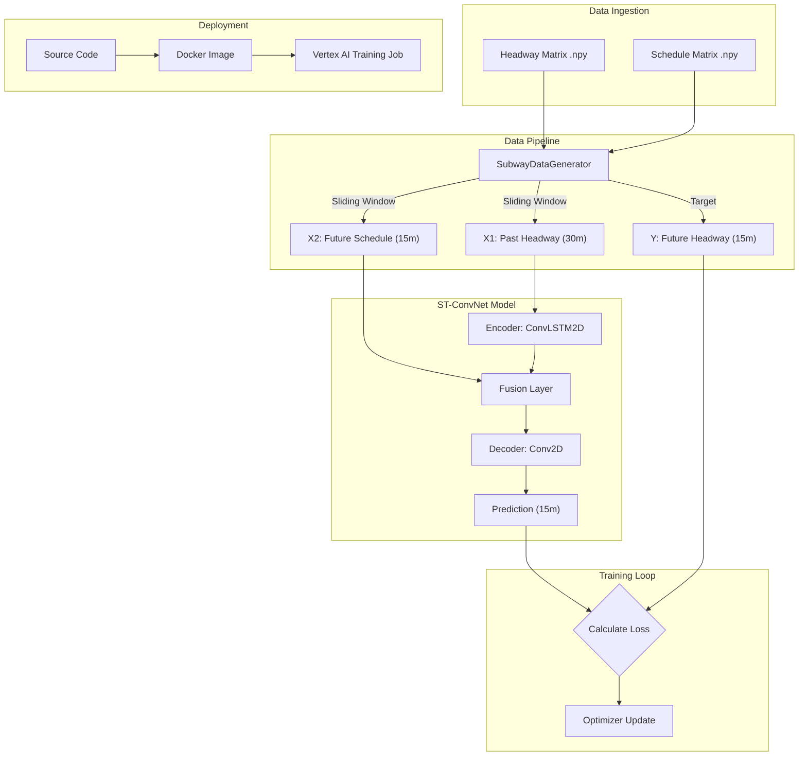

# ST-ConvNet Implementation Plan

This document outlines the step-by-step plan to implement the Spatio-Temporal Convolutional Network (ST-ConvNet) baseline for subway headway prediction.

## ML Workflow Overview

## Phase 1: Project Scaffolding & Configuration

**Goal:** Structure the code into a modular `src/` package to ensure it is clean, reusable, and container-ready.

**Step 1: Create Directory Structure**
*   Create `src/` with `__init__.py`.
*   Create submodules: `src/data/`, `src/models/`, `src/training/`.
*   Create `deploy/` for Docker and Cloud Build files.

**Step 2: Define Configuration (`src/config.py`)**
*   Create a `Config` class to centralize all hyperparameters found in `new_model_architecture.md`.
*   **Variables:** `LOOKBACK_MINS=30`, `FORECAST_MINS=15`, `BATCH_SIZE=128`, `EPOCHS=30`, `FILTERS=64`, `KERNEL_SIZE=(3,3)`.
*   **Paths:** Define default paths for `.npy` files (local vs. container paths).

## Phase 2: Data Pipeline Implementation

**Goal:** Create a robust data loader that handles the "Dual Input" requirement (Headway History + Future Schedule) efficiently.

**Step 3: Implement Data Generator (`src/data/dataset.py`)**
*   Create class `SubwayDataGenerator`.
*   **Method `load_data()`**: Load `.npy` files, normalize (divide by 30), and cast to `float32`.
*   **Method `make_dataset()`**:
    *   Use `keras.utils.timeseries_dataset_from_array` to create sliding windows.
    *   **Input X1 (Headway):** Window `[t-30 : t]`.
    *   **Input X2 (Schedule):** Window `[t : t+15]` (The schedule for the *future* window we are predicting).
    *   **Target Y:** Window `[t : t+15]` (The actual future headways).
    *   **Zip:** Combine X1 and X2 into a tuple `((x_headway, x_schedule), y_target)`.

## Phase 3: Model Architecture

**Goal:** Implement the Keras Functional API model wrapped in a class for easy instantiation.

**Step 4: Implement ST-ConvNet (`src/models/st_convnet.py`)**
*   Create class `HeadwayConvLSTM`.
*   **Method `build_model()`**:
    *   **Input 1:** `(30, Stations, 2, 1)` (Headway).
    *   **Input 2:** `(15, 2, 1)` (Schedule).
    *   **Encoder:** `ConvLSTM2D` layers to process the 30-min history.
    *   **Fusion:** Broadcast the Schedule data to match the spatial dimensions of the Encoder output and concatenate.
    *   **Decoder:** `Conv2D` (or `Conv3D`/`ConvLSTM2D`) layers to generate the 15-min forecast.
    *   **Output:** `(15, Stations, 2, 1)`.

## Phase 4: Training Logic

**Goal:** Encapsulate the training loop and callbacks.

**Step 5: Implement Trainer (`src/training/trainer.py`)**
*   Create class `Trainer`.
*   **Method `compile_and_fit()`**:
    *   Setup Optimizer (`Adam`).
    *   Setup Loss (`MSE` or `MAE`).
    *   Setup Callbacks: `EarlyStopping` (patience=5), `ModelCheckpoint` (save best model).
    *   Run `model.fit()`.

## Phase 5: Local Verification

**Goal:** Verify the pipeline works on a small slice of data before scaling up.

**Step 6: Jupyter Notebook Test (`notebooks/5_model_dev_test.ipynb`)**
*   Import `Config`, `SubwayDataGenerator`, `HeadwayConvLSTM`, `Trainer`.
*   Load a small slice of data (e.g., first 1000 rows).
*   Instantiate the model and print `model.summary()` to verify shapes.
*   Run training for 1 epoch to ensure the pipeline flows without errors.

## Phase 6: Containerization & Vertex AI

**Goal:** Package the code for cloud training.

**Step 7: Docker Setup (`deploy/Dockerfile`)**
*   Base image: `us-docker.pkg.dev/vertex-ai/training/tf-gpu.2-14.py310:latest`.
*   Copy `src/` and `requirements.txt`.
*   Entrypoint: `python -m src.training.main`.

**Step 8: Entrypoint Script (`src/training/main.py`)**
*   A script that ties everything together: parses args, loads data, trains, and saves the model to GCS.

**Step 9: Submission Script (`deploy/submit_job.sh`)**
*   Bash script to:
    1.  Build the Docker image.
    2.  Push to Google Artifact Registry.
    3.  Submit a Vertex AI Custom Training Job using `gcloud ai custom-jobs create`.
